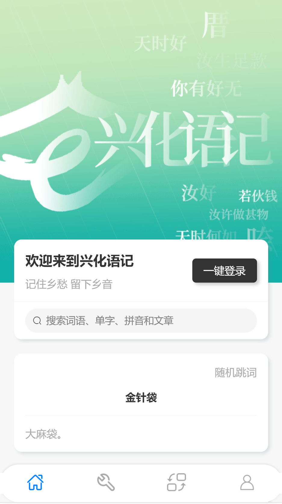

# 兴化语记（uni-app版）

## 项目简介

兴化语记是 [E方言](https://edialect.top) 中`莆仙方言公共服务包` 的别称，主要服务对象包括福建省莆田市及其周边地区的莆仙方言使用者。

兴化语记目前包括网页端 ( https://pxm.edialect.top , https://hinghwa.cn )，微信小程序端（兴化语记），计划在本项目中通过 `uni-app` 增加移动端 ( https://m.pxm.edialect.top )，QQ小程序端等。

## 技术栈简介

> 本项目采用前后端分离技术，关于后端的介绍可见[此处](https://github.com/e-dialect/hinghwa-dict-backend)。

`uni-app` 是一个使用 [Vue.js](https://vuejs.org/) 开发所有前端应用的框架，开发者编写一套代码，可发布到iOS、Android、Web（响应式）、以及各种小程序（微信/支付宝/百度/头条/飞书/QQ/快手/钉钉/淘宝）、快应用等多个平台。

项目主体采用 `Vue2` + `webpack`，之所以不采用 `Vue3` + `Vite` 的原因在于，这个仓库源自于[原先的微信小程序代码](https://github.com/e-dialect/hinghwa-dict-mp-weixin)，通过 `uni-app` 提供的插件一键转化为 `uni-app` 应用。（因此代码前期会充满着 `refactor` 和 `fix`，彻底完成转化之后才适时添加新功能）

UI 组件使用  [`ColorUI`](https://github.com/weilanwl/ColorUI/) ，这是一款适应于H5、微信小程序、安卓、iOS、支付宝的高颜值，高度自定义的 CSS 组件库。
